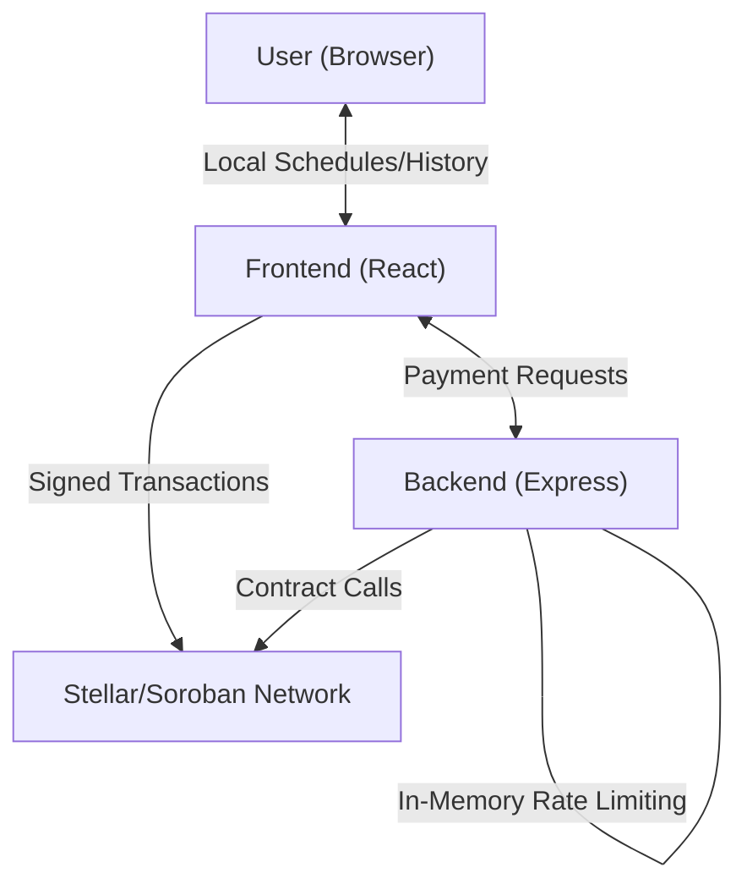

# Database & Data Model Documentation

This document provides a comprehensive overview of the data persistence and management strategy for the Wata-Board project. The system utilizes a multi-layered approach, ranging from permanent blockchain records to transient in-memory buffers.

## 🏗️ Data Architecture Overview

Wata-Board does not use a traditional relational database (like PostgreSQL or MongoDB). Instead, it follows a decentralized data model:

1.  **Stellar/Soroban Blockchain**: The primary source of truth for all financial transactions and payment balances.
2.  **Frontend LocalStorage**: Secondary persistence for user-specific configurations, payment schedules, and history, enabling offline support.
3.  **Backend In-Memory Cache**: Transient storage for rate limiting, request queuing, and active process tracking.

---

## 🔗 Layer 1: Blockchain (Primary Persistence)

The **Soroban Smart Contract** maintains the global state of all utility payments.

### Data Models
- **`total_paid` (Map)**: A mapping of unique `meter_id` (String) to a `u32` value representing the total amount of XLM paid towards that utility meter.

### Persistence Guarantees
- Immutable, decentralized, and verifiable.
- Data remains available as long as the Stellar network exists.

---

## 💾 Layer 2: Frontend LocalStorage (Secondary Persistence)

The frontend application uses **LocalStorage** to provide a rich user experience, even when offline. This data is managed by the `SchedulingService`.

### Persistent Keys:
- `wata-board-schedules`: Stores an array of `PaymentSchedule` objects.
- `wata-board-payments`: Stores an array of `ScheduledPayment` objects.

### Data Models

#### `PaymentSchedule`
| Field | Type | Description |
| :--- | :--- | :--- |
| `id` | `string` | Unique identifier (e.g., `schedule_1711379...`) |
| `userId` | `string` | Link to the user's wallet address |
| `meterId` | `string` | The utility meter being paid |
| `amount` | `number` | Amount per payment (in XLM) |
| `frequency` | `enum` | `once`, `daily`, `weekly`, `monthly`, etc. |
| `startDate` | `Date` | When the schedule begins |
| `nextPaymentDate` | `Date` | When the next payment is due |
| `status` | `enum` | `scheduled`, `active`, `completed`, `failed` |
| `paymentHistory` | `ScheduledPayment[]` | Inline history of related payments |

#### `ScheduledPayment`
| Field | Type | Description |
| :--- | :--- | :--- |
| `id` | `string` | Unique payment identifier |
| `scheduleId` | `string` | Parent schedule ID |
| `amount` | `number` | Payment amount |
| `scheduledDate` | `Date` | Scheduled execution time |
| `status` | `enum` | `pending`, `processing`, `completed`, `failed` |
| `transactionId` | `string` (opt) | Stellar transaction hash |
| `retryCount` | `number` | Number of failed attempts |

---

## ⚡ Layer 3: Backend In-Memory (Transient Data)

The backend (`wata-board-dapp`) uses memory-based Map structures to manage high-volume application logic.

### Transient Structures
- **`userRequests` (Map)**: Tracks user rate limit window timestamps.
- **`requestQueue` (Map)**: Manages overflow requests when limits are exceeded.
- **`pendingPayments` (Map)**: Tracks payments that are currently in the middle of a blockchain interaction.

> [!WARNING]
> **Data Loss**: All Layer 3 data is lost if the backend server restarts. For higher reliability, consider migrating these maps to a Redis instance.

---

## 🔄 Migrations & Schema Evolution

### Current Strategy
- **Implicit Migrations**: The project currently uses TypeScript types and manual JSON parsing. If a schema change occurs, previous data in `localStorage` may become incompatible.
- **Blockchain**: Contract state is managed via Soroban's native contract versioning and upgrade mechanisms.

### Recommended Strategy for Scale
1.  **Frontend Data Evolution**: Implement a versioned `localStorage` strategy with migration functions to transform older JSON structures.
2.  **External Persistence**: Transition Backend Layer 3 to **Redis** to maintain rate limits across server restarts/clusters.
3.  **Analytics Layer**: If historical data analysis is needed, implement a **Stellar Indexer** (like Apollo or Horizon) to sync blockchain events to a dedicated SQL database (PostgreSQL).
