# Wata Board Data Flow Documentation

## Overview

This document provides comprehensive documentation of data flows within the Wata Board system, including transaction processing, synchronization patterns, caching strategies, and integration points with external systems.

## 1. System Data Flow Architecture

### 1.1 High-Level Data Flow

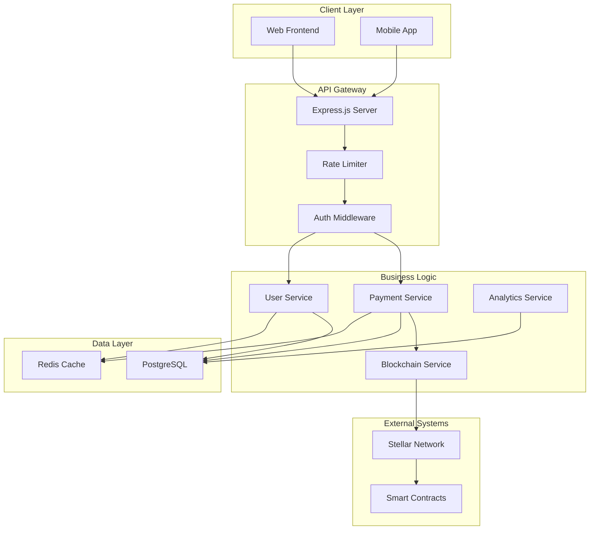
```mermaid
flowchart TD
    subgraph "Client Layer"
        A[Web Frontend]
        B[Mobile App]
    end
    
    subgraph "API Gateway"
        C[Express.js Server]
        D[Rate Limiter]
        E[Auth Middleware]
    end
    
    subgraph "Business Logic"
        F[Payment Service]
        G[User Service]
        H[Analytics Service]
        I[Blockchain Service]
    end
    
    subgraph "Data Layer"
        J[PostgreSQL]
        K[Redis Cache]
    end
    
    subgraph "External Systems"
        L[Stellar Network]
        M[Smart Contracts]
    end
    
    A --> C
    B --> C
    C --> D
    D --> E
    E --> F
    E --> G
    F --> I
    G --> J
    H --> J
    I --> L
    L --> M
    F --> J
    F --> K
    G --> K
```

### 1.2 Data Flow Categories

1. **User Request Flows** - API requests from clients
2. **Payment Processing Flows** - Transaction handling
3. **Blockchain Synchronization Flows** - Data sync with Stellar
4. **Cache Management Flows** - Performance optimization
5. **Analytics Flows** - Data aggregation and reporting
6. **Audit Flows** - Logging and compliance

## 2. User Request Data Flows

### 2.1 User Registration Flow

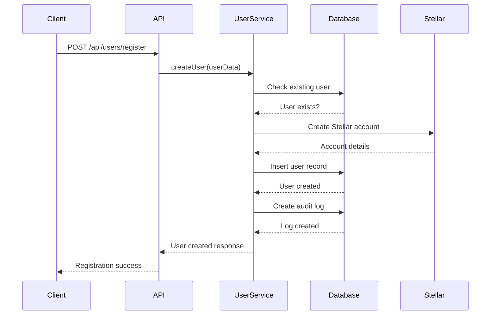
```mermaid
sequenceDiagram
    participant Client
    participant API
    participant UserService
    participant Database
    participant Stellar
    
    Client->>API: POST /api/users/register
    API->>UserService: createUser(userData)
    UserService->>Database: Check existing user
    Database-->>UserService: User exists?
    UserService->>Stellar: Create Stellar account
    Stellar-->>UserService: Account details
    UserService->>Database: Insert user record
    Database-->>UserService: User created
    UserService->>Database: Create audit log
    Database-->>UserService: Log created
    UserService-->>API: User created response
    API-->>Client: Registration success
```

**Data Elements:**
- **Input**: User email, phone, full_name, Stellar public key
- **Processing**: Validation, Stellar account creation, database insertion
- **Output**: User ID, authentication token, account details
- **Side Effects**: Audit log entry, user record creation

### 2.2 Payment Initiation Flow

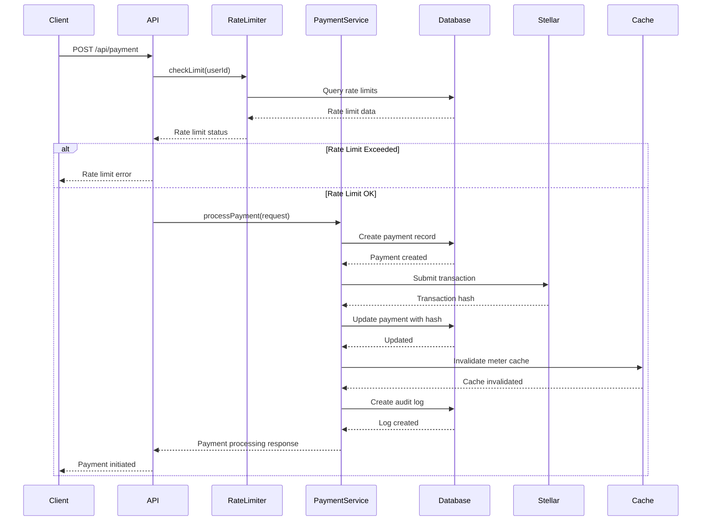
```mermaid
sequenceDiagram
    participant Client
    participant API
    participant RateLimiter
    participant PaymentService
    participant Database
    participant Stellar
    participant Cache
    
    Client->>API: POST /api/payment
    API->>RateLimiter: checkLimit(userId)
    RateLimiter->>Database: Query rate limits
    Database-->>RateLimiter: Rate limit data
    RateLimiter-->>API: Rate limit status
    
    alt Rate Limit Exceeded
        API-->>Client: Rate limit error
    else Rate Limit OK
        API->>PaymentService: processPayment(request)
        PaymentService->>Database: Create payment record
        Database-->>PaymentService: Payment created
        PaymentService->>Stellar: Submit transaction
        Stellar-->>PaymentService: Transaction hash
        PaymentService->>Database: Update payment with hash
        Database-->>PaymentService: Updated
        PaymentService->>Cache: Invalidate meter cache
        Cache-->>PaymentService: Cache invalidated
        PaymentService->>Database: Create audit log
        Database-->>PaymentService: Log created
        PaymentService-->>API: Payment processing response
        API-->>Client: Payment initiated
    end
```

**Data Elements:**
- **Input**: meter_id, amount, userId
- **Processing**: Rate limiting, payment creation, blockchain submission
- **Output**: Transaction ID, status, rate limit info
- **Side Effects**: Payment record, cache invalidation, audit log

## 3. Payment Processing Data Flows

### 3.1 Complete Payment Lifecycle

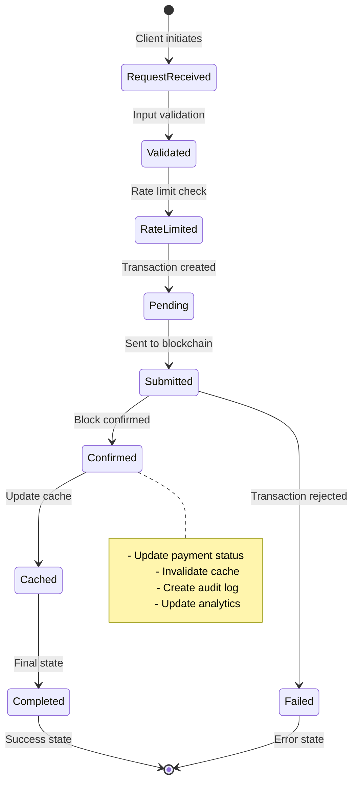
```mermaid
stateDiagram-v2
    [*] --> RequestReceived: Client initiates
    RequestReceived --> Validated: Input validation
    Validated --> RateLimited: Rate limit check
    RateLimited --> Pending: Transaction created
    Pending --> Submitted: Sent to blockchain
    Submitted --> Confirmed: Block confirmed
    Submitted --> Failed: Transaction rejected
    Confirmed --> Cached: Update cache
    Cached --> Completed: Final state
    Failed --> [*]: Error state
    Completed --> [*]: Success state
    
    note right of Confirmed
        - Update payment status
        - Invalidate cache
        - Create audit log
        - Update analytics
    end note
```

### 3.2 Payment State Transitions

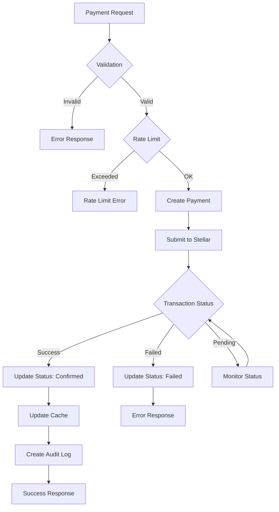
```mermaid
flowchart TD
    A[Payment Request] --> B{Validation}
    B -->|Invalid| C[Error Response]
    B -->|Valid| D{Rate Limit}
    D -->|Exceeded| E[Rate Limit Error]
    D -->|OK| F[Create Payment]
    F --> G[Submit to Stellar]
    G --> H{Transaction Status}
    H -->|Success| I[Update Status: Confirmed]
    H -->|Failed| J[Update Status: Failed]
    H -->|Pending| K[Monitor Status]
    K --> H
    I --> L[Update Cache]
    L --> M[Create Audit Log]
    M --> N[Success Response]
    J --> O[Error Response]
```

### 3.3 Payment Data Flow Details

**Stage 1: Request Processing**
```typescript
interface PaymentRequest {
    meter_id: string;
    amount: number;
    userId: string;
}

// Data validation flow
function validatePayment(request: PaymentRequest): ValidationResult {
    // 1. Check required fields
    // 2. Validate data types
    // 3. Check business rules
    // 4. Return validation result
}
```

**Stage 2: Rate Limiting**
```typescript
interface RateLimitResult {
    allowed: boolean;
    queued: boolean;
    remainingRequests: number;
    resetTime: Date;
    queuePosition?: number;
}

// Rate limiting data flow
function checkRateLimit(userId: string): RateLimitResult {
    // 1. Query current usage from database
    // 2. Calculate remaining requests
    // 3. Update usage counters
    // 4. Return rate limit status
}
```

**Stage 3: Blockchain Integration**
```typescript
interface BlockchainTransaction {
    hash: string;
    xdr: string;
    status: 'pending' | 'confirmed' | 'failed';
    blockNumber?: number;
    blockTimestamp?: Date;
}

// Blockchain data flow
function submitTransaction(payment: PaymentRequest): BlockchainTransaction {
    // 1. Build Stellar transaction
    // 2. Sign with admin key
    // 3. Submit to network
    // 4. Return transaction details
}
```

## 4. Blockchain Synchronization Flows

### 4.1 Real-time Event Processing

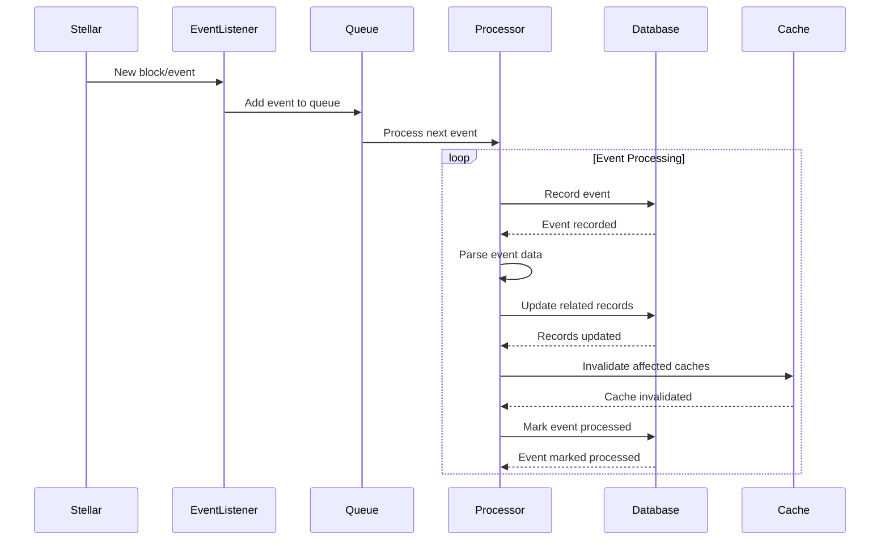
```mermaid
sequenceDiagram
    participant Stellar
    participant EventListener
    participant Queue
    participant Processor
    participant Database
    participant Cache
    
    Stellar->>EventListener: New block/event
    EventListener->>Queue: Add event to queue
    Queue->>Processor: Process next event
    
    loop Event Processing
        Processor->>Database: Record event
        Database-->>Processor: Event recorded
        Processor->>Processor: Parse event data
        Processor->>Database: Update related records
        Database-->>Processor: Records updated
        Processor->>Cache: Invalidate affected caches
        Cache-->>Processor: Cache invalidated
        Processor->>Database: Mark event processed
        Database-->>Processor: Event marked processed
    end
```

### 4.2 Sync Status Management

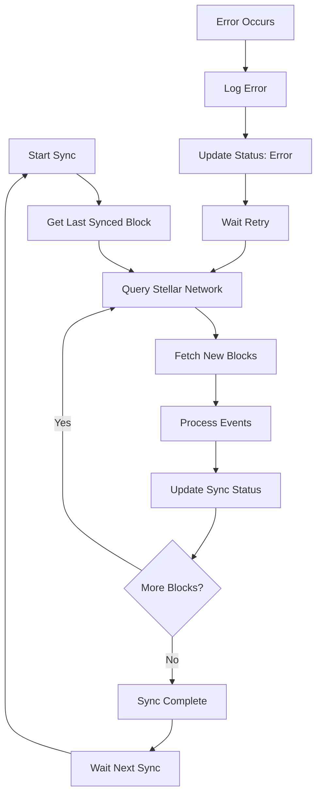
```mermaid
flowchart TD
    A[Start Sync] --> B[Get Last Synced Block]
    B --> C[Query Stellar Network]
    C --> D[Fetch New Blocks]
    D --> E[Process Events]
    E --> F[Update Sync Status]
    F --> G{More Blocks?}
    G -->|Yes| C
    G -->|No| H[Sync Complete]
    H --> I[Wait Next Sync]
    I --> A
    
    J[Error Occurs] --> K[Log Error]
    K --> L[Update Status: Error]
    L --> M[Wait Retry]
    M --> C
```

### 4.3 Event Types and Processing

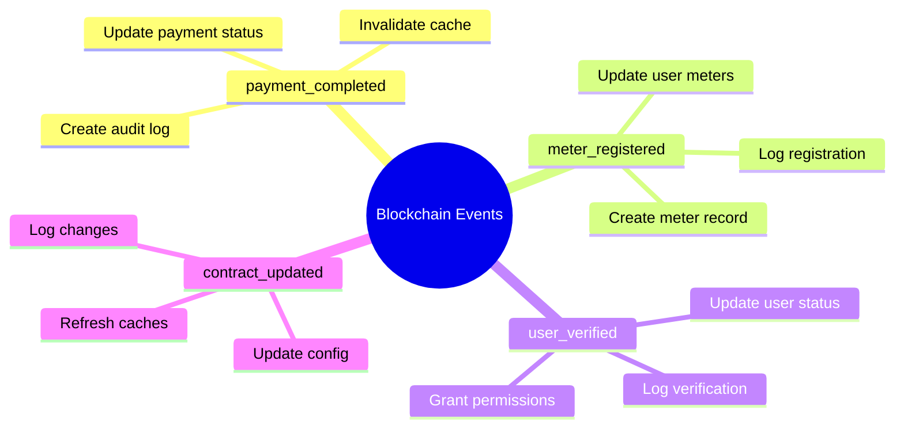
```mermaid
mindmap
  root((Blockchain Events))
    payment_completed
      Update payment status
      Invalidate cache
      Create audit log
    meter_registered
      Create meter record
      Update user meters
      Log registration
    user_verified
      Update user status
      Grant permissions
      Log verification
    contract_updated
      Update config
      Refresh caches
      Log changes
```

## 5. Cache Management Data Flows

### 5.1 Cache Strategy Overview

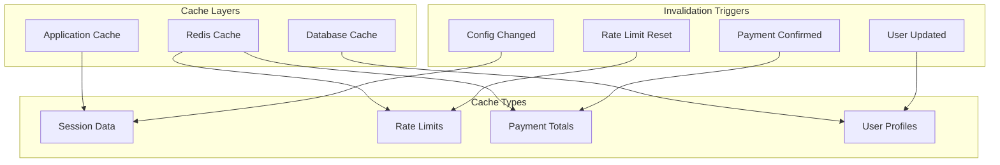
```mermaid
graph TB
    subgraph "Cache Layers"
        A[Application Cache]
        B[Redis Cache]
        C[Database Cache]
    end
    
    subgraph "Cache Types"
        D[Session Data]
        E[Rate Limits]
        F[Payment Totals]
        G[User Profiles]
    end
    
    subgraph "Invalidation Triggers"
        H[Payment Confirmed]
        I[User Updated]
        J[Rate Limit Reset]
        K[Config Changed]
    end
    
    A --> D
    B --> E
    B --> F
    C --> G
    
    H --> F
    I --> G
    J --> E
    K --> D
```

### 5.2 Payment Cache Flow

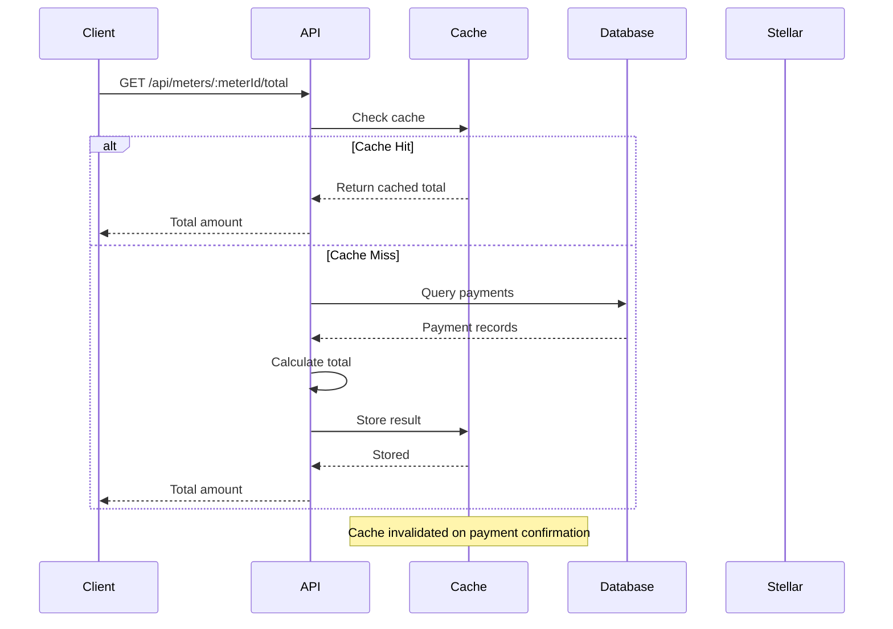
```mermaid
sequenceDiagram
    participant Client
    participant API
    participant Cache
    participant Database
    participant Stellar
    
    Client->>API: GET /api/meters/:meterId/total
    API->>Cache: Check cache
    alt Cache Hit
        Cache-->>API: Return cached total
        API-->>Client: Total amount
    else Cache Miss
        API->>Database: Query payments
        Database-->>API: Payment records
        API->>API: Calculate total
        API->>Cache: Store result
        Cache-->>API: Stored
        API-->>Client: Total amount
    end
    
    Note over Cache: Cache invalidated on payment confirmation
```

### 5.3 Cache Invalidation Patterns

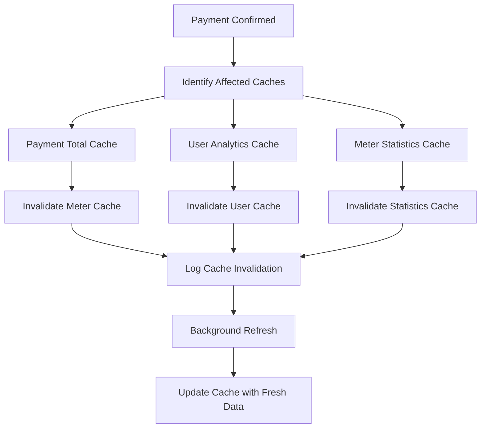
```mermaid
flowchart TD
    A[Payment Confirmed] --> B[Identify Affected Caches]
    B --> C[Payment Total Cache]
    B --> D[User Analytics Cache]
    B --> E[Meter Statistics Cache]
    
    C --> F[Invalidate Meter Cache]
    D --> G[Invalidate User Cache]
    E --> H[Invalidate Statistics Cache]
    
    F --> I[Log Cache Invalidation]
    G --> I
    H --> I
    
    I --> J[Background Refresh]
    J --> K[Update Cache with Fresh Data]
```

## 6. Analytics Data Flows

### 6.1 Real-time Analytics Pipeline

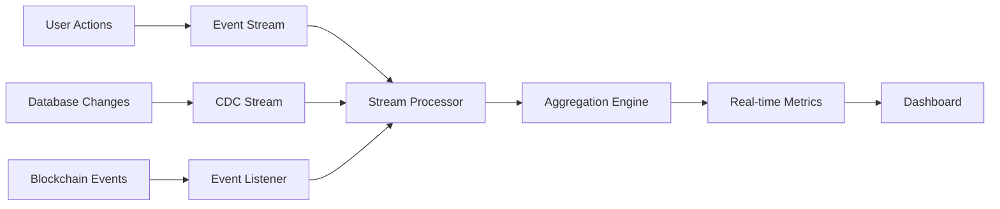
```mermaid
flowchart LR
    A[User Actions] --> B[Event Stream]
    B --> C[Stream Processor]
    C --> D[Aggregation Engine]
    D --> E[Real-time Metrics]
    E --> F[Dashboard]
    
    G[Database Changes] --> H[CDC Stream]
    H --> C
    
    I[Blockchain Events] --> J[Event Listener]
    J --> C
```

### 6.2 Batch Analytics Processing


```mermaid
gantt
    title Daily Analytics Processing Schedule
    dateFormat  HH:mm
    section Data Collection
    Extract Payment Data    :a1, 00:00, 30m
    Extract User Data       :a2, after a1, 15m
    Extract Blockchain Data :a3, after a2, 15m
    section Processing
    Calculate Metrics       :b1, after a3, 45m
    Generate Reports        :b2, after b1, 30m
    section Distribution
    Update Dashboards       :c1, after b2, 15m
    Send Notifications      :c2, after c1, 15m
```

### 6.3 Analytics Data Flow Details

```typescript
interface AnalyticsMetrics {
    date: Date;
    totalPayments: number;
    totalAmount: number;
    uniqueUsers: number;
    averageAmount: number;
    successRate: number;
}

// Analytics processing flow
async function generateDailyMetrics(date: Date): Promise<AnalyticsMetrics> {
    // 1. Extract payment data
    // 2. Calculate aggregations
    // 3. Join with user data
    // 4. Compute metrics
    // 5. Store results
}
```

## 7. Audit and Logging Data Flows

### 7.1 Audit Trail Architecture

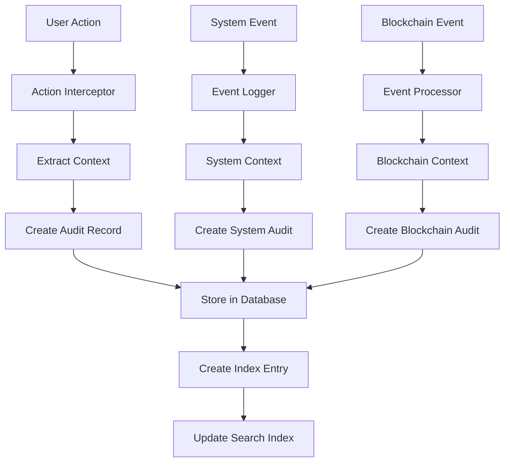
```mermaid
flowchart TD
    A[User Action] --> B[Action Interceptor]
    B --> C[Extract Context]
    C --> D[Create Audit Record]
    D --> E[Store in Database]
    E --> F[Create Index Entry]
    F --> G[Update Search Index]
    
    H[System Event] --> I[Event Logger]
    I --> J[System Context]
    J --> K[Create System Audit]
    K --> E
    
    L[Blockchain Event] --> M[Event Processor]
    M --> N[Blockchain Context]
    N --> O[Create Blockchain Audit]
    O --> E
```

### 7.2 Audit Data Structure

```typescript
interface AuditLog {
    id: string;
    userId?: string;
    action: string;
    resourceType: string;
    resourceId?: string;
    oldValues?: Record<string, any>;
    newValues?: Record<string, any>;
    ipAddress?: string;
    userAgent?: string;
    timestamp: Date;
    context?: Record<string, any>;
}
```

### 7.3 Compliance Data Flow

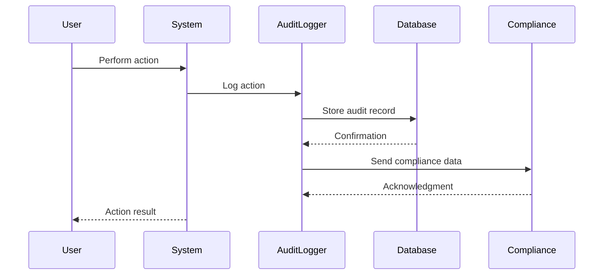
```mermaid
sequenceDiagram
    participant User
    participant System
    participant AuditLogger
    participant Database
    participant Compliance
    
    User->>System: Perform action
    System->>AuditLogger: Log action
    AuditLogger->>Database: Store audit record
    Database-->>AuditLogger: Confirmation
    AuditLogger->>Compliance: Send compliance data
    Compliance-->>AuditLogger: Acknowledgment
    System-->>User: Action result
```

## 8. Error Handling and Recovery Flows

### 8.1 Transaction Error Recovery

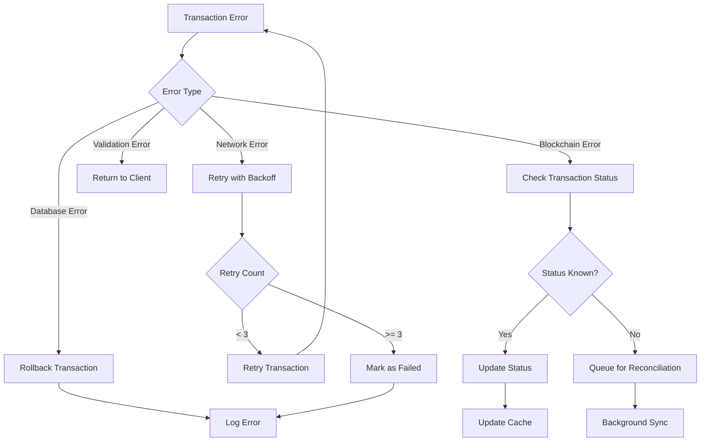
```mermaid
flowchart TD
    A[Transaction Error] --> B{Error Type}
    B -->|Network Error| C[Retry with Backoff]
    B -->|Validation Error| D[Return to Client]
    B -->|Blockchain Error| E[Check Transaction Status]
    B -->|Database Error| F[Rollback Transaction]
    
    C --> G{Retry Count}
    G -->|< 3| H[Retry Transaction]
    G -->|>= 3| I[Mark as Failed]
    H --> A
    
    E --> J{Status Known?}
    J -->|Yes| K[Update Status]
    J -->|No| L[Queue for Reconciliation]
    
    F --> M[Log Error]
    I --> M
    K --> N[Update Cache]
    L --> O[Background Sync]
```

### 8.2 Data Consistency Flows

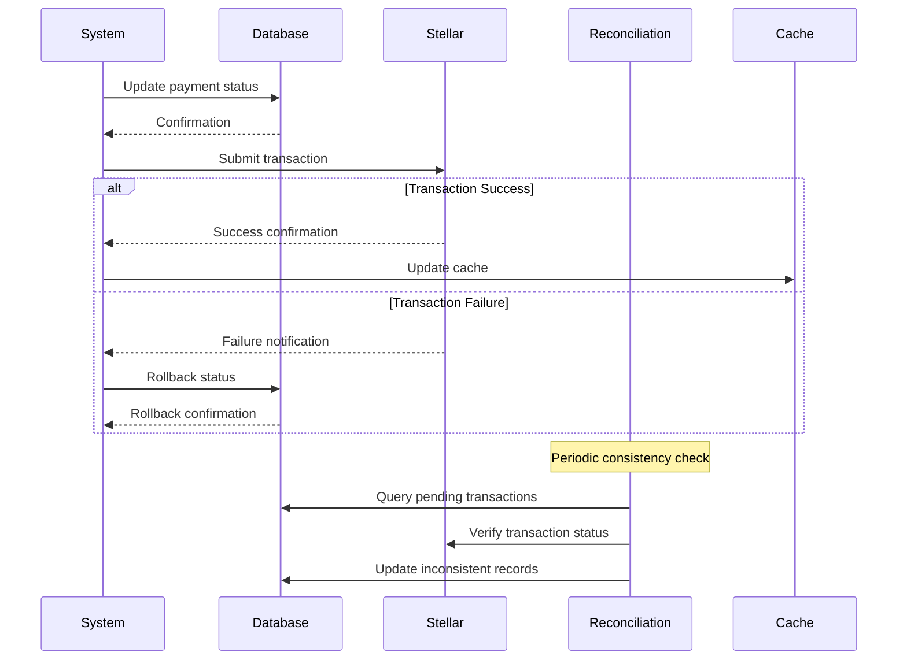
```mermaid
sequenceDiagram
    participant System
    participant Database
    participant Stellar
    participant Reconciliation
    participant Cache
    
    System->>Database: Update payment status
    Database-->>System: Confirmation
    System->>Stellar: Submit transaction
    
    alt Transaction Success
        Stellar-->>System: Success confirmation
        System->>Cache: Update cache
    else Transaction Failure
        Stellar-->>System: Failure notification
        System->>Database: Rollback status
        Database-->>System: Rollback confirmation
    end
    
    Note over Reconciliation: Periodic consistency check
    Reconciliation->>Database: Query pending transactions
    Reconciliation->>Stellar: Verify transaction status
    Reconciliation->>Database: Update inconsistent records
```

## 9. Performance Optimization Flows

### 9.1 Query Optimization

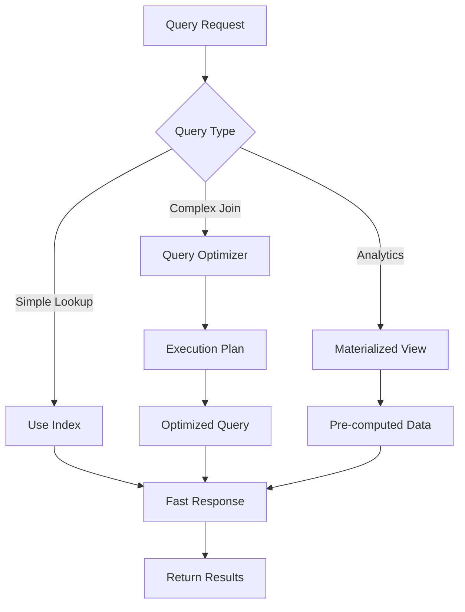
```mermaid
flowchart TD
    A[Query Request] --> B{Query Type}
    B -->|Simple Lookup| C[Use Index]
    B -->|Complex Join| D[Query Optimizer]
    B -->|Analytics| E[Materialized View]
    
    C --> F[Fast Response]
    D --> G[Execution Plan]
    G --> H[Optimized Query]
    H --> F
    
    E --> I[Pre-computed Data]
    I --> F
    
    F --> J[Return Results]
```

### 9.2 Connection Pool Management

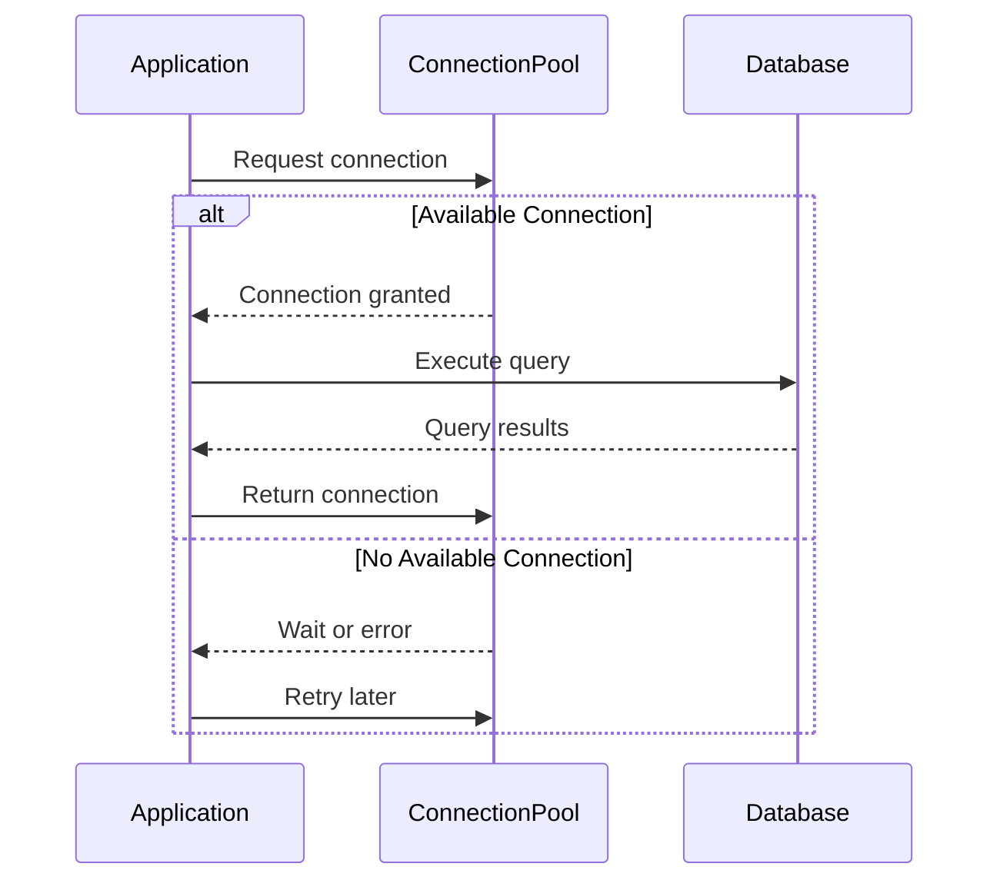
```mermaid
sequenceDiagram
    participant Application
    participant ConnectionPool
    participant Database
    
    Application->>ConnectionPool: Request connection
    alt Available Connection
        ConnectionPool-->>Application: Connection granted
        Application->>Database: Execute query
        Database-->>Application: Query results
        Application->>ConnectionPool: Return connection
    else No Available Connection
        ConnectionPool-->>Application: Wait or error
        Application->>ConnectionPool: Retry later
    end
```

## 10. Integration Data Flows

### 10.1 External API Integration

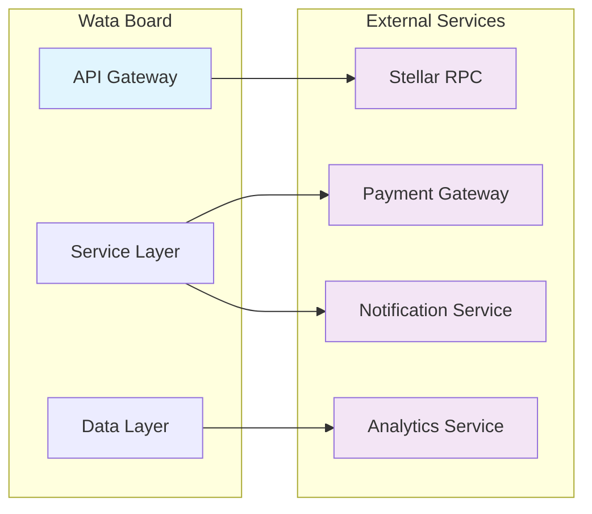
```mermaid
flowchart LR
    subgraph "Wata Board"
        A[API Gateway]
        B[Service Layer]
        C[Data Layer]
    end
    
    subgraph "External Services"
        D[Stellar RPC]
        E[Payment Gateway]
        F[Analytics Service]
        G[Notification Service]
    end
    
    A --> D
    B --> E
    C --> F
    B --> G
    
    style A fill:#e1f5fe
    style D fill:#f3e5f5
    style E fill:#f3e5f5
    style F fill:#f3e5f5
    style G fill:#f3e5f5
```

### 10.2 Data Exchange Formats

```mermaid
mindmap
  root((Data Formats))
    Internal APIs
      JSON
      Protocol Buffers
    Blockchain
      XDR
      Base64
    External APIs
      JSON
      XML
    Analytics
      CSV
      Parquet
    Backups
      SQL Dump
      Compressed JSON
```

## 11. Monitoring and Observability Flows

### 11.1 Metrics Collection Flow

```mermaid
sequenceDiagram
    participant Services
    participant MetricsCollector
    participant TimeSeriesDB
    participant AlertManager
    participant Dashboard
    
    Services->>MetricsCollector: Emit metrics
    MetricsCollector->>TimeSeriesDB: Store metrics
    TimeSeriesDB-->>MetricsCollector: Confirmation
    
    loop Monitoring
        MetricsCollector->>TimeSeriesDB: Query metrics
        TimeSeriesDB-->>MetricsCollector: Data
        MetricsCollector->>AlertManager: Evaluate rules
        AlertManager->>Dashboard: Update displays
    end
```

### 11.2 Distributed Tracing

```mermaid
flowchart TD
    A[Client Request] --> B[API Gateway]
    B --> C[Payment Service]
    C --> D[Database]
    C --> E[Stellar Network]
    
    F[Trace Context] --> B
    B --> G[Span: API Request]
    G --> H[Span: Payment Processing]
    H --> I[Span: Database Query]
    H --> J[Span: Blockchain Call]
    
    I --> K[Trace Collector]
    J --> K
    K --> L[Trace Storage]
    L --> M[Trace Analysis]
```

## 12. Security Data Flows

### 12.1 Authentication Flow

```mermaid
sequenceDiagram
    participant Client
    participant AuthAPI
    participant AuthService
    participant Database
    participant TokenStore
    
    Client->>AuthAPI: Login request
    AuthAPI->>AuthService: Authenticate credentials
    AuthService->>Database: Verify user
    Database-->>AuthService: User data
    AuthService->>AuthService: Generate tokens
    AuthService->>TokenStore: Store refresh token
    TokenStore-->>AuthService: Confirmation
    AuthService-->>AuthAPI: Authentication result
    AuthAPI-->>Client: JWT tokens
```

### 12.2 Authorization Flow

```mermaid
flowchart TD
    A[API Request] --> B[Extract JWT]
    B --> C[Validate Token]
    C --> D{Token Valid?}
    D -->|No| E[Return 401]
    D -->|Yes| F[Extract Permissions]
    F --> G[Check Resource Access]
    G --> H{Authorized?}
    H -->|No| I[Return 403]
    H -->|Yes| J[Process Request]
    J --> K[Log Access]
    K --> L[Return Response]
```

## 13. Backup and Recovery Flows

### 13.1 Backup Process

```mermaid
gantt
    title Backup Schedule
    dateFormat  HH:mm
    section Daily Backups
    Full Database Backup    :a1, 02:00, 2h
    Verify Backup           :a2, after a1, 30m
    section Real-time
    Transaction Log Backup  :b1, 00:00, 24h
    section Weekly
    Archive to Cloud        :c1, 04:00, 3h
    Test Restore            :c2, after c1, 2h
```

### 13.2 Disaster Recovery Flow

```mermaid
flowchart TD
    A[Disaster Detected] --> B[Activate Recovery Plan]
    B --> C[Switch to Backup System]
    C --> D[Restore from Latest Backup]
    D --> E[Verify Data Integrity]
    E --> F{Data Valid?}
    F -->|No| G[Try Previous Backup]
    F -->|Yes| H[Update DNS/Load Balancer]
    G --> D
    H --> I[Monitor System]
    I --> J[Notify Stakeholders]
    J --> K[Post-mortem Analysis]
```

This comprehensive data flow documentation provides a detailed understanding of how data moves through the Wata Board system, enabling developers to maintain, optimize, and extend the platform effectively.
