# Wata Board Data Model Diagrams

## Overview

This document contains visual representations of the Wata Board data model, including entity relationship diagrams, data flow diagrams, and architectural components.

## 1. Entity Relationship Diagram (ERD)

### 1.1 Core Entities

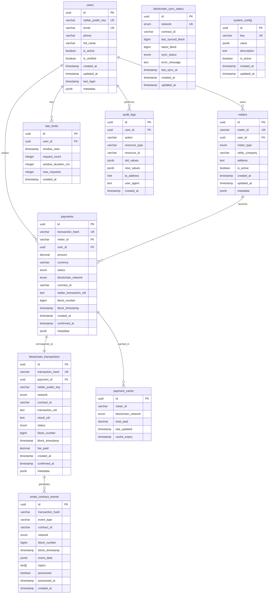
```mermaid
erDiagram
    users {
        uuid id PK
        varchar stellar_public_key UK
        varchar email UK
        varchar phone
        varchar full_name
        boolean is_active
        boolean is_verified
        timestamp created_at
        timestamp updated_at
        timestamp last_login
        jsonb metadata
    }

    meters {
        uuid id PK
        varchar meter_id UK
        uuid user_id FK
        enum meter_type
        varchar utility_company
        text address
        boolean is_active
        timestamp created_at
        timestamp updated_at
        jsonb metadata
    }

    payments {
        uuid id PK
        varchar transaction_hash UK
        varchar meter_id FK
        uuid user_id FK
        decimal amount
        varchar currency
        enum status
        enum blockchain_network
        varchar contract_id
        text stellar_transaction_xdr
        bigint block_number
        timestamp block_timestamp
        timestamp created_at
        timestamp confirmed_at
        jsonb metadata
    }

    blockchain_transactions {
        uuid id PK
        varchar transaction_hash UK
        uuid payment_id FK
        varchar stellar_public_key
        enum network
        varchar contract_id
        text transaction_xdr
        text result_xdr
        enum status
        bigint block_number
        timestamp block_timestamp
        decimal fee_paid
        timestamp created_at
        timestamp confirmed_at
        jsonb metadata
    }

    payment_cache {
        uuid id PK
        varchar meter_id
        enum blockchain_network
        decimal total_paid
        timestamp last_updated
        timestamp cache_expiry
    }

    rate_limits {
        uuid id PK
        uuid user_id FK
        timestamp window_start
        integer request_count
        integer window_duration_ms
        integer max_requests
        timestamp created_at
    }

    audit_logs {
        uuid id PK
        uuid user_id FK
        varchar action
        varchar resource_type
        varchar resource_id
        jsonb old_values
        jsonb new_values
        inet ip_address
        text user_agent
        timestamp created_at
    }

    smart_contract_events {
        uuid id PK
        varchar transaction_hash
        varchar event_type
        varchar contract_id
        enum network
        bigint block_number
        timestamp block_timestamp
        jsonb event_data
        text[] topics
        boolean processed
        timestamp processed_at
        timestamp created_at
    }

    blockchain_sync_status {
        uuid id PK
        enum network UK
        varchar contract_id
        bigint last_synced_block
        bigint latest_block
        enum sync_status
        text error_message
        timestamp last_sync_at
        timestamp created_at
        timestamp updated_at
    }

    system_config {
        uuid id PK
        varchar key UK
        jsonb value
        text description
        boolean is_active
        timestamp created_at
        timestamp updated_at
    }

    %% Relationships
    users ||--o{ meters : owns
    users ||--o{ payments : makes
    users ||--o{ rate_limits : has
    users ||--o{ audit_logs : performs
    meters ||--o{ payments : receives
    payments ||--|| blockchain_transactions : corresponds_to
    payments ||--o{ payment_cache : cached_in
    blockchain_transactions ||--o{ smart_contract_events : generates
```

### 1.2 Relationship Details

#### Users to Meters (One-to-Many)
- **Relationship**: A user can own multiple meters
- **Cardinality**: 1:N
- **Foreign Key**: `meters.user_id` → `users.id`
- **Cascade**: Delete user deletes associated meters

#### Users to Payments (One-to-Many)
- **Relationship**: A user can make multiple payments
- **Cardinality**: 1:N
- **Foreign Key**: `payments.user_id` → `users.id`
- **Cascade**: Delete user deletes associated payments

#### Meters to Payments (One-to-Many)
- **Relationship**: A meter can receive multiple payments
- **Cardinality**: 1:N
- **Foreign Key**: `payments.meter_id` → `meters.meter_id`
- **Cascade**: Delete meter deletes associated payments

#### Payments to Blockchain Transactions (One-to-One)
- **Relationship**: Each payment corresponds to one blockchain transaction
- **Cardinality**: 1:1
- **Foreign Key**: `blockchain_transactions.payment_id` → `payments.id`
- **Cascade**: Delete payment deletes associated blockchain transaction

## 2. Data Flow Diagrams

### 2.1 Payment Processing Flow

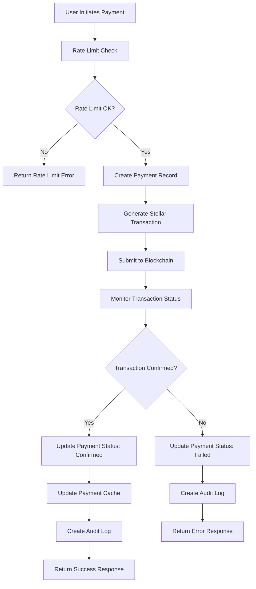
```mermaid
flowchart TD
    A[User Initiates Payment] --> B[Rate Limit Check]
    B --> C{Rate Limit OK?}
    C -->|No| D[Return Rate Limit Error]
    C -->|Yes| E[Create Payment Record]
    E --> F[Generate Stellar Transaction]
    F --> G[Submit to Blockchain]
    G --> H[Monitor Transaction Status]
    H --> I{Transaction Confirmed?}
    I -->|No| J[Update Payment Status: Failed]
    I -->|Yes| K[Update Payment Status: Confirmed]
    K --> L[Update Payment Cache]
    L --> M[Create Audit Log]
    M --> N[Return Success Response]
    J --> O[Create Audit Log]
    O --> P[Return Error Response]
```

### 2.2 Data Synchronization Flow

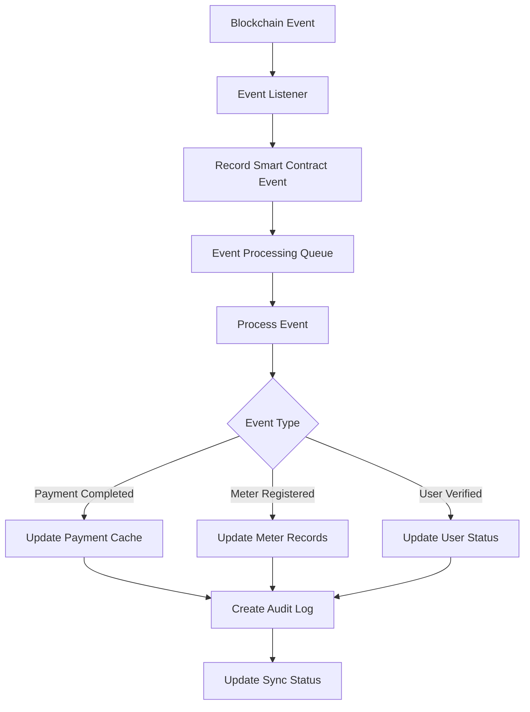
```mermaid
flowchart TD
    A[Blockchain Event] --> B[Event Listener]
    B --> C[Record Smart Contract Event]
    C --> D[Event Processing Queue]
    D --> E[Process Event]
    E --> F{Event Type}
    F -->|Payment Completed| G[Update Payment Cache]
    F -->|Meter Registered| H[Update Meter Records]
    F -->|User Verified| I[Update User Status]
    G --> J[Create Audit Log]
    H --> J
    I --> J
    J --> K[Update Sync Status]
```

### 2.3 Cache Management Flow

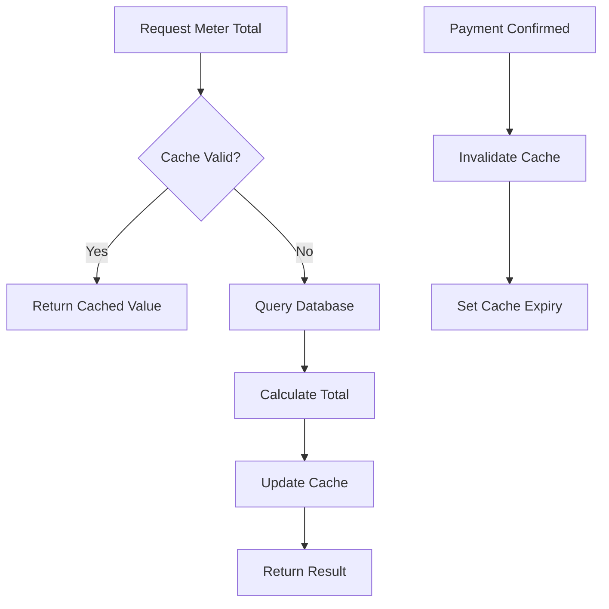
```mermaid
flowchart TD
    A[Request Meter Total] --> B{Cache Valid?}
    B -->|Yes| C[Return Cached Value]
    B -->|No| D[Query Database]
    D --> E[Calculate Total]
    E --> F[Update Cache]
    F --> G[Return Result]
    H[Payment Confirmed] --> I[Invalidate Cache]
    I --> J[Set Cache Expiry]
```

## 3. System Architecture Diagram

### 3.1 High-Level Architecture

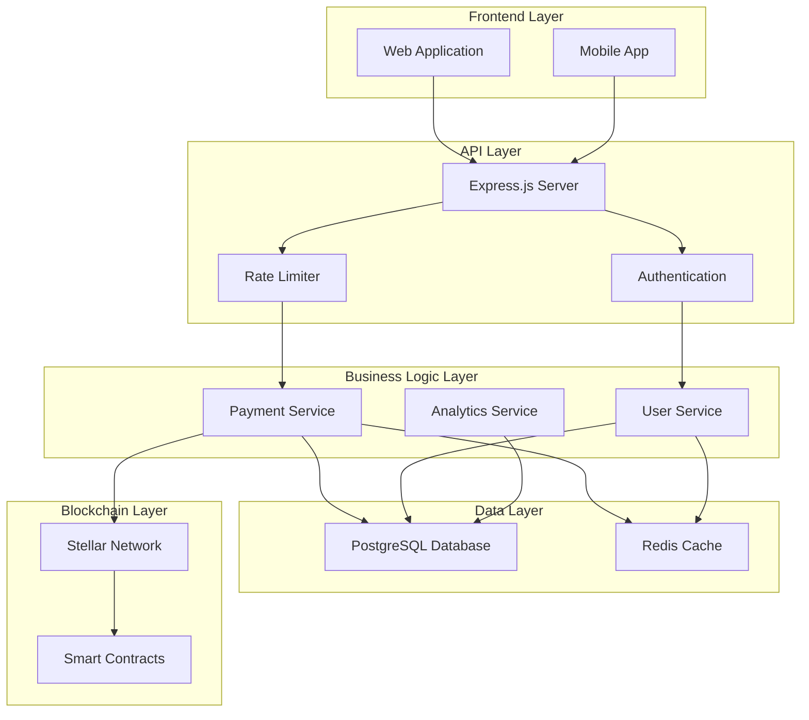
```mermaid
graph TB
    subgraph "Frontend Layer"
        A[Web Application]
        B[Mobile App]
    end
    
    subgraph "API Layer"
        C[Express.js Server]
        D[Rate Limiter]
        E[Authentication]
    end
    
    subgraph "Business Logic Layer"
        F[Payment Service]
        G[User Service]
        H[Analytics Service]
    end
    
    subgraph "Data Layer"
        I[PostgreSQL Database]
        J[Redis Cache]
    end
    
    subgraph "Blockchain Layer"
        K[Stellar Network]
        L[Smart Contracts]
    end
    
    A --> C
    B --> C
    C --> D
    C --> E
    D --> F
    E --> G
    F --> I
    G --> I
    H --> I
    F --> J
    G --> J
    F --> K
    K --> L
```

### 3.2 Database Schema Architecture

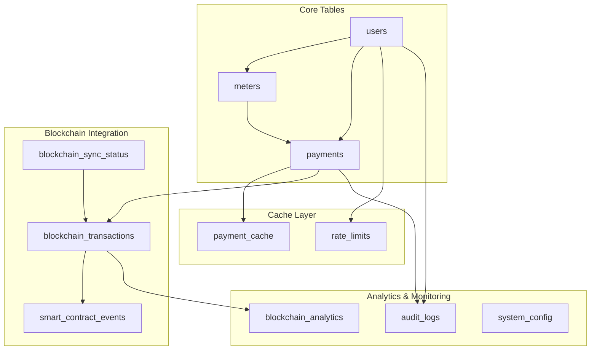
```mermaid
graph TB
    subgraph "Core Tables"
        A[users]
        B[meters]
        C[payments]
    end
    
    subgraph "Cache Layer"
        D[payment_cache]
        E[rate_limits]
    end
    
    subgraph "Blockchain Integration"
        F[blockchain_transactions]
        G[smart_contract_events]
        H[blockchain_sync_status]
    end
    
    subgraph "Analytics & Monitoring"
        I[audit_logs]
        J[blockchain_analytics]
        K[system_config]
    end
    
    A --> B
    A --> C
    B --> C
    C --> D
    A --> E
    C --> F
    F --> G
    H --> F
    A --> I
    C --> I
    F --> J
```

## 4. State Transition Diagrams

### 4.1 Payment Status Transitions

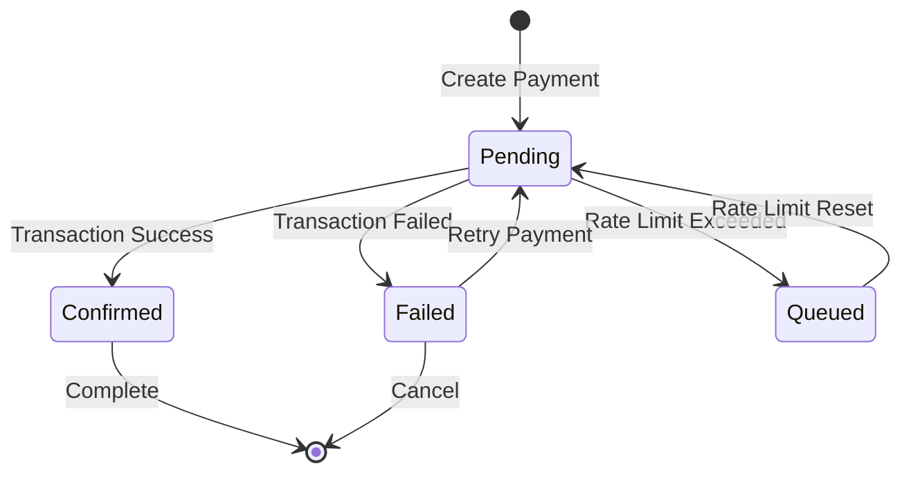
```mermaid
stateDiagram-v2
    [*] --> Pending : Create Payment
    Pending --> Confirmed : Transaction Success
    Pending --> Failed : Transaction Failed
    Pending --> Queued : Rate Limit Exceeded
    Queued --> Pending : Rate Limit Reset
    Failed --> Pending : Retry Payment
    Confirmed --> [*] : Complete
    Failed --> [*] : Cancel
```

### 4.2 Blockchain Transaction Status

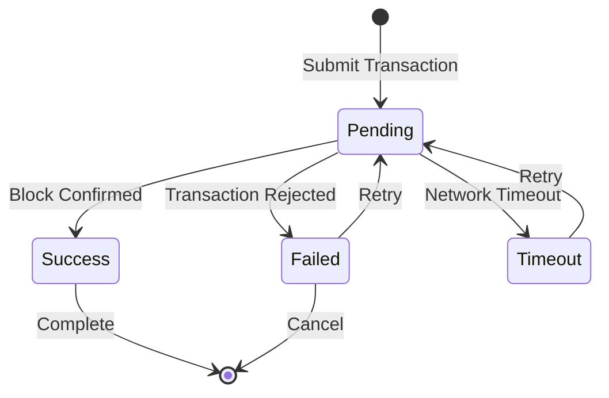
```mermaid
stateDiagram-v2
    [*] --> Pending : Submit Transaction
    Pending --> Success : Block Confirmed
    Pending --> Failed : Transaction Rejected
    Pending --> Timeout : Network Timeout
    Success --> [*] : Complete
    Failed --> Pending : Retry
    Timeout --> Pending : Retry
    Failed --> [*] : Cancel
```

### 4.3 User Verification States

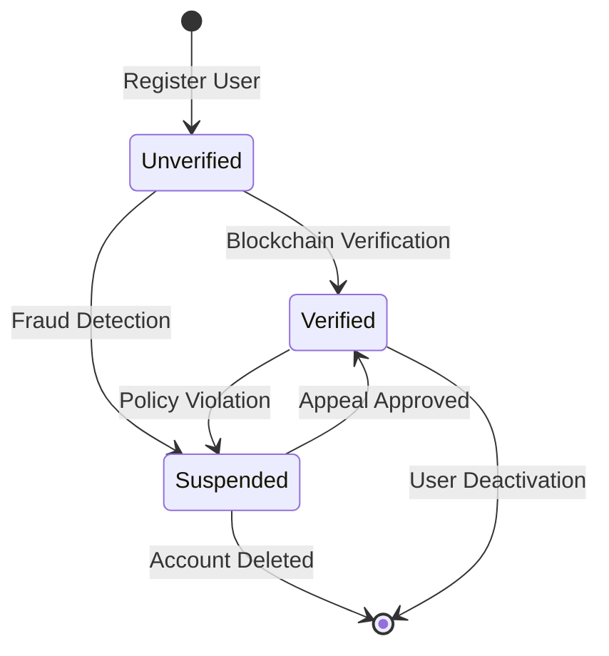
```mermaid
stateDiagram-v2
    [*] --> Unverified : Register User
    Unverified --> Verified : Blockchain Verification
    Unverified --> Suspended : Fraud Detection
    Verified --> Suspended : Policy Violation
    Suspended --> Verified : Appeal Approved
    Suspended --> [*] : Account Deleted
    Verified --> [*] : User Deactivation
```

## 5. Data Model Constraints

### 5.1 Primary Key Constraints

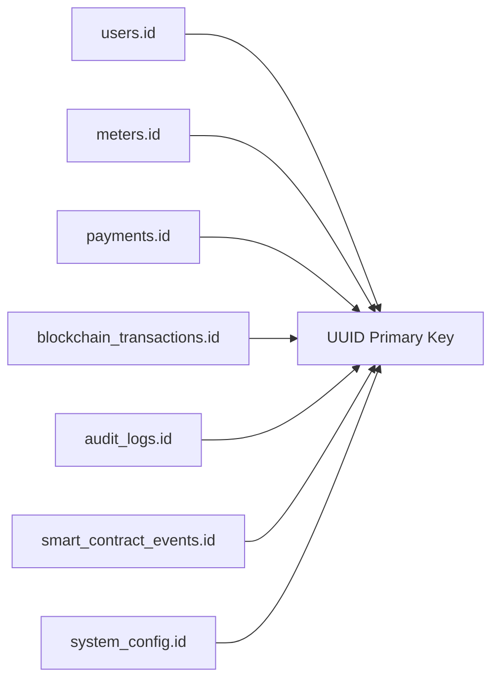
```mermaid
graph LR
    A[users.id] --> B[UUID Primary Key]
    C[meters.id] --> B
    D[payments.id] --> B
    E[blockchain_transactions.id] --> B
    F[audit_logs.id] --> B
    G[smart_contract_events.id] --> B
    H[system_config.id] --> B
```

### 5.2 Unique Constraints

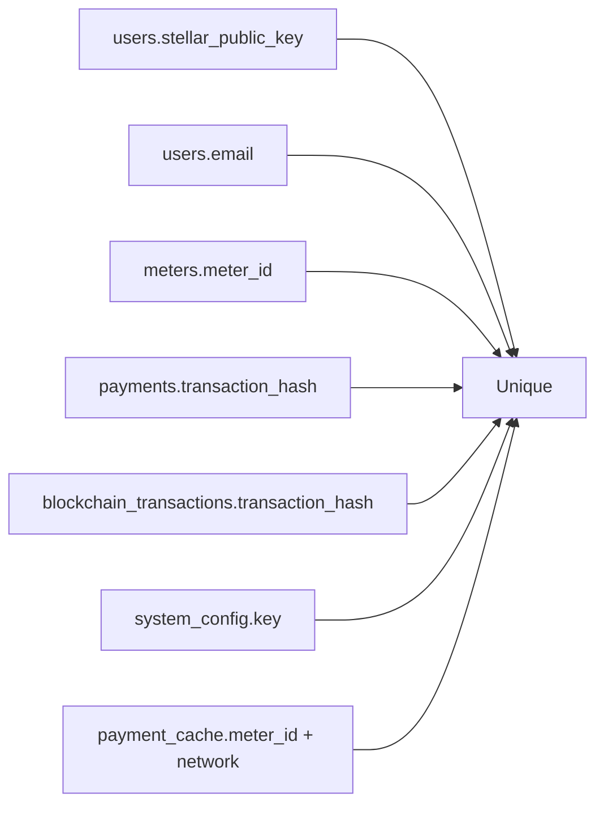
```mermaid
graph LR
    A[users.stellar_public_key] --> B[Unique]
    C[users.email] --> B
    D[meters.meter_id] --> B
    E[payments.transaction_hash] --> B
    F[blockchain_transactions.transaction_hash] --> B
    G[system_config.key] --> B
    H[payment_cache.meter_id + network] --> B
```

### 5.3 Foreign Key Relationships

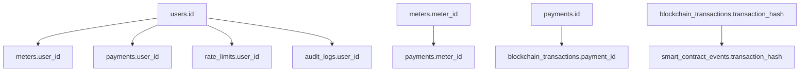
```mermaid
graph TD
    A[users.id] --> B[meters.user_id]
    A --> C[payments.user_id]
    A --> D[rate_limits.user_id]
    A --> E[audit_logs.user_id]
    
    F[meters.meter_id] --> G[payments.meter_id]
    
    H[payments.id] --> I[blockchain_transactions.payment_id]
    
    J[blockchain_transactions.transaction_hash] --> K[smart_contract_events.transaction_hash]
```

## 6. Index Strategy Visualization

### 6.1 Performance Indexes

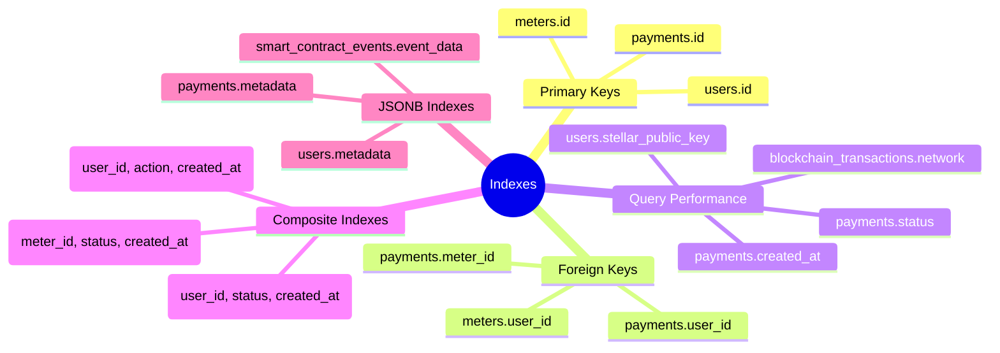
```mermaid
mindmap
  root((Indexes))
    Primary Keys
      users.id
      meters.id
      payments.id
    Foreign Keys
      meters.user_id
      payments.user_id
      payments.meter_id
    Query Performance
      payments.status
      payments.created_at
      users.stellar_public_key
      blockchain_transactions.network
    Composite Indexes
      payments(user_id, status, created_at)
      payments(meter_id, status, created_at)
      audit_logs(user_id, action, created_at)
    JSONB Indexes
      users.metadata
      payments.metadata
      smart_contract_events.event_data
```

## 7. Data Volume Considerations

### 7.1 Table Growth Projections

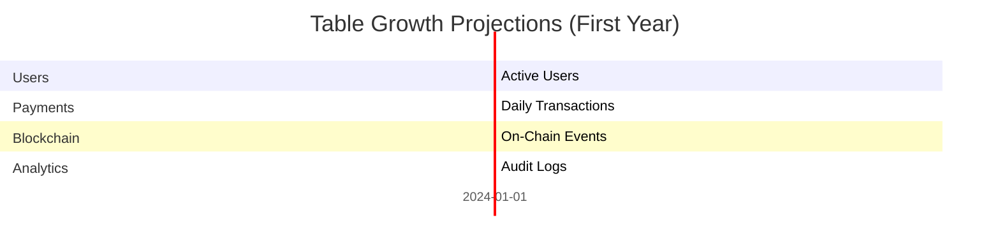
```mermaid
gantt
    title Table Growth Projections (First Year)
    dateFormat  YYYY-MM
    section Users
    Active Users    :active, 2024-01, 12
    section Payments
    Daily Transactions :daily, 2024-01, 12
    section Blockchain
    On-Chain Events    :events, 2024-01, 12
    section Analytics
    Audit Logs         :logs, 2024-01, 12
```

### 7.2 Storage Requirements

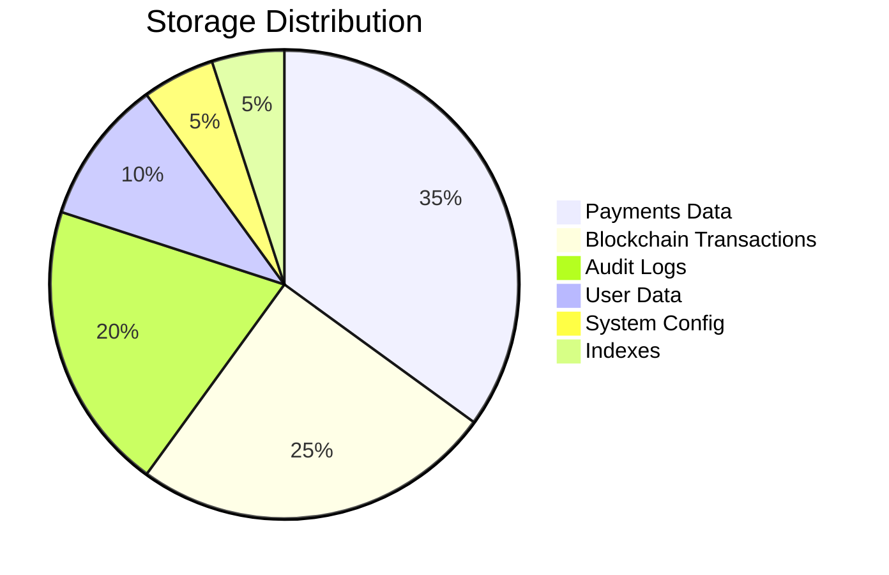
```mermaid
pie title Storage Distribution
    "Payments Data" : 35
    "Blockchain Transactions" : 25
    "Audit Logs" : 20
    "User Data" : 10
    "System Config" : 5
    "Indexes" : 5
```

## 8. Security Model Diagram

### 8.1 Access Control

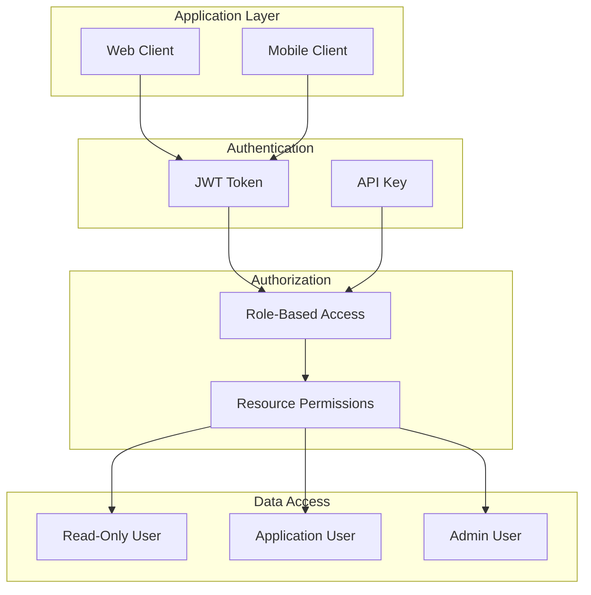
```mermaid
graph TB
    subgraph "Application Layer"
        A[Web Client]
        B[Mobile Client]
    end
    
    subgraph "Authentication"
        C[JWT Token]
        D[API Key]
    end
    
    subgraph "Authorization"
        E[Role-Based Access]
        F[Resource Permissions]
    end
    
    subgraph "Data Access"
        G[Read-Only User]
        H[Application User]
        I[Admin User]
    end
    
    A --> C
    B --> C
    C --> E
    D --> E
    E --> F
    F --> G
    F --> H
    F --> I
```

### 8.2 Data Encryption

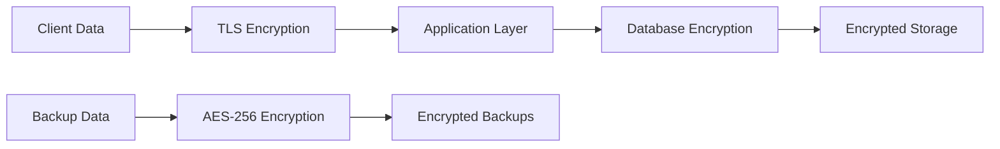
```mermaid
flowchart LR
    A[Client Data] --> B[TLS Encryption]
    B --> C[Application Layer]
    C --> D[Database Encryption]
    D --> E[Encrypted Storage]
    
    F[Backup Data] --> G[AES-256 Encryption]
    G --> H[Encrypted Backups]
```

## 9. Monitoring and Analytics

### 9.1 Key Metrics Flow

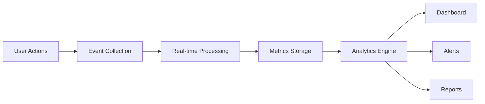
```mermaid
graph LR
    A[User Actions] --> B[Event Collection]
    B --> C[Real-time Processing]
    C --> D[Metrics Storage]
    D --> E[Analytics Engine]
    E --> F[Dashboard]
    E --> G[Alerts]
    E --> H[Reports]
```

### 9.2 Performance Monitoring

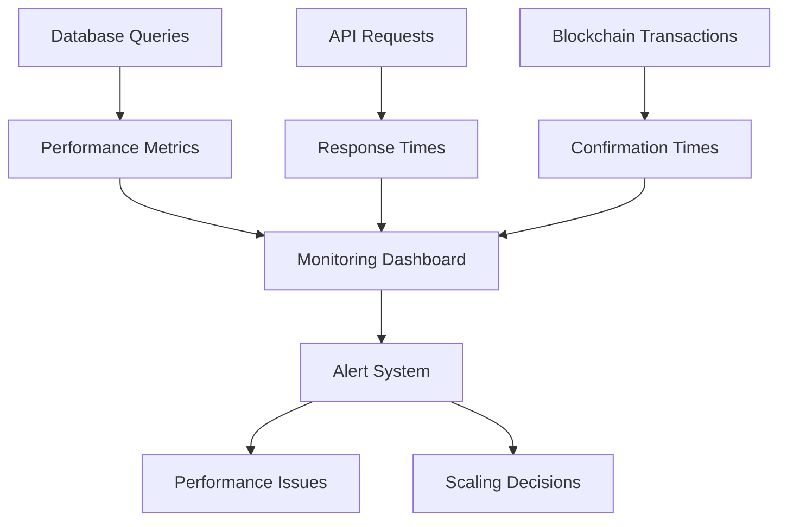
```mermaid
graph TB
    A[Database Queries] --> B[Performance Metrics]
    C[API Requests] --> D[Response Times]
    E[Blockchain Transactions] --> F[Confirmation Times]
    
    B --> G[Monitoring Dashboard]
    D --> G
    F --> G
    
    G --> H[Alert System]
    H --> I[Performance Issues]
    H --> J[Scaling Decisions]
```

## 10. Integration Points

### 10.1 External System Integration

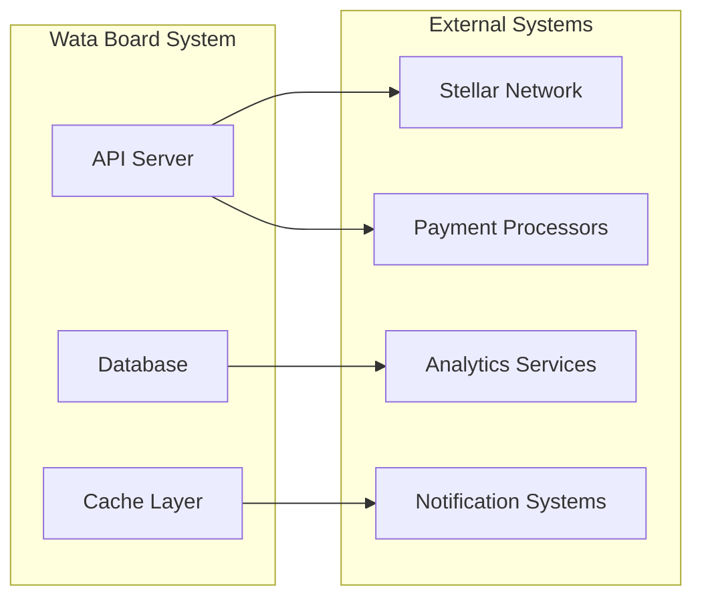
```mermaid
graph LR
    subgraph "Wata Board System"
        A[API Server]
        B[Database]
        C[Cache Layer]
    end
    
    subgraph "External Systems"
        D[Stellar Network]
        E[Payment Processors]
        F[Analytics Services]
        G[Notification Systems]
    end
    
    A --> D
    A --> E
    B --> F
    C --> G
```

### 10.2 Data Exchange Formats

```mermaid
graph TB
    A[Internal Data] --> B[JSON API]
    B --> C[External Systems]
    
    D[Blockchain Data] --> E[XDR Format]
    E --> F[Stellar Network]
    
    G[Analytics Data] --> H[CSV/JSON Export]
    H --> I[Business Intelligence]
```

These diagrams provide a comprehensive visual representation of the Wata Board data model, helping developers understand the relationships, data flows, and architectural components of the system.
