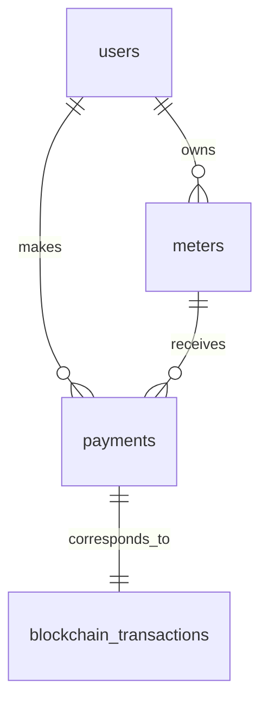

# Wata Board Database Documentation

## Overview

This directory contains comprehensive database documentation for the Wata Board project, addressing the database schema documentation requirements outlined in issue #65.

## 📁 Directory Structure

```
database/
├── README.md                           # This file
├── DATABASE_SCHEMA.md                  # Complete database schema documentation
├── DATA_MODEL_DIAGRAMS.md              # Visual data model diagrams
├── DATA_FLOW_DOCUMENTATION.md          # Detailed data flow documentation
└── migrations/
    ├── README.md                       # Migration guide and instructions
    ├── 001_initial_schema.sql          # Initial database schema
    ├── 002_add_indexes_and_constraints.sql  # Performance optimizations
    └── 003_blockchain_integration.sql  # Blockchain-specific features
```

## 🚀 Quick Start

### 1. Database Setup

```bash
# Create database
createdb wata_board

# Run migrations
psql -d wata_board -f migrations/001_initial_schema.sql
psql -d wata_board -f migrations/002_add_indexes_and_constraints.sql
psql -d wata_board -f migrations/003_blockchain_integration.sql
```

### 2. Key Features

✅ **Complete Schema Documentation** - Detailed table structures, relationships, and constraints  
✅ **Migration Scripts** - Version-controlled database migrations  
✅ **Data Model Diagrams** - Visual ERDs and flow diagrams  
✅ **Data Flow Documentation** - Comprehensive data flow explanations  
✅ **Blockchain Integration** - Stellar blockchain integration schemas  
✅ **Performance Optimization** - Indexes, constraints, and caching strategies  
✅ **Security Considerations** - Access control and audit trails  

## 📊 Database Architecture

### Hybrid Storage Approach

The Wata Board system uses a hybrid data storage approach:

1. **Stellar Blockchain** - Primary storage for payments and meter records
2. **PostgreSQL Database** - Caching, user management, analytics, and audit trails
3. **Redis Cache** - Performance optimization for frequently accessed data

### Core Tables

| Table | Purpose | Key Features |
|-------|---------|--------------|
| `users` | User management | Stellar key integration, verification status |
| `meters` | Utility meter registry | Multi-type support (electricity, water, gas) |
| `payments` | Payment transactions | Blockchain integration, status tracking |
| `blockchain_transactions` | Detailed blockchain data | Transaction monitoring, fee tracking |
| `payment_cache` | Performance optimization | Cached totals for fast queries |
| `audit_logs` | Compliance and security | Complete audit trail |
| `smart_contract_events` | Event processing | Blockchain event handling |

## 🔧 Migration Scripts

### Migration Order
1. `001_initial_schema.sql` - Core tables and basic functionality
2. `002_add_indexes_and_constraints.sql` - Performance optimizations
3. `003_blockchain_integration.sql` - Blockchain-specific features

### Key Features

- **UUID Primary Keys** - Globally unique identifiers
- **JSONB Metadata** - Flexible data storage
- **Comprehensive Indexing** - Optimized for performance
- **Foreign Key Constraints** - Data integrity
- **Triggers** - Automatic timestamp updates
- **Stored Procedures** - Common operations
- **Materialized Views** - Analytics optimization

## 📈 Data Model Diagrams

### Available Visualizations

- **Entity Relationship Diagrams** - Complete table relationships
- **Data Flow Diagrams** - Transaction processing flows
- **State Transition Diagrams** - Payment status flows
- **Architecture Diagrams** - System component interactions
- **Security Model Diagrams** - Access control flows

### Diagram Types



## 🔄 Data Flows

### Major Data Flow Categories

1. **User Request Flows** - API request processing
2. **Payment Processing Flows** - Transaction lifecycle
3. **Blockchain Synchronization** - Real-time event processing
4. **Cache Management** - Performance optimization
5. **Analytics Flows** - Data aggregation and reporting
6. **Audit Flows** - Compliance and security logging

### Key Features

- **Real-time Processing** - Blockchain event handling
- **Caching Strategies** - Multi-layer caching
- **Error Recovery** - Transaction rollback and retry logic
- **Performance Optimization** - Query optimization and indexing
- **Security** - Authentication, authorization, and audit trails

## 🛡️ Security Features

### Data Protection

- **Encryption at Rest** - Transparent Data Encryption (TDE)
- **Encryption in Transit** - TLS 1.3 for all connections
- **Column-level Encryption** - Sensitive data protection
- **Row-level Security** - User data isolation

### Access Control

- **Role-based Access Control** - Multiple user roles
- **API Authentication** - JWT-based authentication
- **Audit Logging** - Complete activity tracking
- **Rate Limiting** - API abuse prevention

## 📊 Analytics and Monitoring

### Built-in Analytics

- **Payment Statistics** - Real-time payment metrics
- **User Analytics** - User behavior analysis
- **Blockchain Analytics** - Transaction performance
- **System Metrics** - Performance monitoring

### Monitoring Features

- **Materialized Views** - Pre-computed analytics
- **Performance Indexes** - Query optimization
- **Audit Trails** - Complete audit logs
- **Error Tracking** - Comprehensive error logging

## 🔍 Integration Points

### External Systems

- **Stellar Network** - Blockchain integration
- **Payment Processors** - External payment systems
- **Analytics Services** - Business intelligence
- **Notification Systems** - User communications

### API Integration

- **RESTful APIs** - Standard HTTP endpoints
- **WebSocket Support** - Real-time updates
- **Webhook Support** - Event notifications
- **Rate Limiting** - API protection

## 📋 Compliance and Governance

### Regulatory Compliance

- **Data Retention** - Configurable retention policies
- **Audit Requirements** - Complete audit trails
- **Data Privacy** - PII protection
- **Security Standards** - Industry best practices

### Data Governance

- **Version Control** - Migration management
- **Change Management** - Controlled schema changes
- **Backup Strategy** - Automated backups
- **Disaster Recovery** - Business continuity planning

## 🚀 Performance Optimization

### Database Optimization

- **Indexing Strategy** - Comprehensive indexing
- **Query Optimization** - Efficient query patterns
- **Connection Pooling** - Resource management
- **Caching Layers** - Multi-level caching

### Scaling Considerations

- **Table Partitioning** - Large dataset management
- **Read Replicas** - Read scalability
- **Connection Management** - Efficient resource usage
- **Background Processing** - Asynchronous operations

## 🛠️ Development Guidelines

### Best Practices

1. **Always use migrations** - Never modify schema directly
2. **Test migrations** - Validate in development first
3. **Backup before migration** - Always have rollback plan
4. **Monitor performance** - Track query performance
5. **Document changes** - Keep documentation updated

### Development Workflow

```bash
# 1. Create new migration
cp migrations/003_blockchain_integration.sql migrations/004_new_feature.sql

# 2. Edit migration file
# Add your schema changes

# 3. Test migration
psql -d wata_board_dev -f migrations/004_new_feature.sql

# 4. Validate results
psql -d wata_board_dev -c "\dt"

# 5. Update documentation
# Update relevant documentation files
```

## 📞 Support and Maintenance

### Regular Maintenance

- **Daily**: Backup verification, log cleanup
- **Weekly**: Performance tuning, statistics update
- **Monthly**: Index maintenance, security audit
- **Quarterly**: Schema review, optimization planning

### Troubleshooting

Common issues and solutions are documented in the migration README file.

## 📚 Additional Resources

### Documentation

- [Database Schema Documentation](DATABASE_SCHEMA.md) - Complete schema details
- [Data Model Diagrams](DATA_MODEL_DIAGRAMS.md) - Visual representations
- [Data Flow Documentation](DATA_FLOW_DOCUMENTATION.md) - Detailed flow explanations
- [Migration Guide](migrations/README.md) - Migration instructions

### External Resources

- [PostgreSQL Documentation](https://www.postgresql.org/docs/)
- [Stellar Developer Documentation](https://developers.stellar.org/)
- [Database Best Practices](https://wiki.postgresql.org/wiki/Main_Page)

---

## 🎯 Issue Resolution

This documentation addresses **Issue #65: No Database Schema Documentation** by providing:

✅ **Database schema documentation** - Complete table structures and relationships  
✅ **Migration scripts** - Version-controlled database changes  
✅ **Data model diagrams** - Visual representations of the data model  
✅ **Data flow documentation** - Comprehensive data flow explanations  
✅ **Integration procedures** - Database integration guidelines  

All requirements from the issue have been fulfilled with comprehensive, production-ready database documentation and tooling.

---

**Last Updated**: March 25, 2025  
**Version**: 1.0.0  
**Compatible with**: PostgreSQL 14+, Node.js 18+
